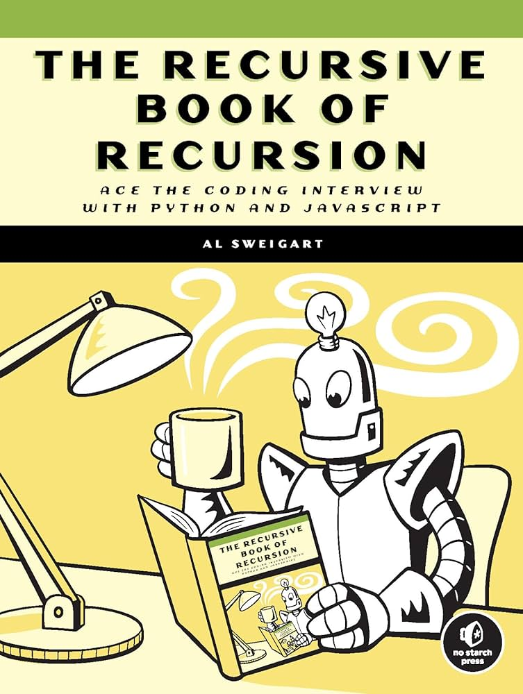

# Solutions to Practice Projects from "The Recursive Book of Recursion"

This repository contains solutions to selected practice projects from "The Recursive Book of Recursion" by Al Sweigart. Each solution demonstrates the use of recursion to solve various problems presented in the book.



## Introduction

"The Recursive Book of Recursion" is a comprehensive guide that explores the concept of recursion through a series of practical and engaging projects. This repository includes solutions to some of the practice projects in the book, providing clear and concise implementations to help learners understand and apply recursion effectively.

## Projects Covered

The projects included in this repository cover a range of topics and difficulties, showcasing the versatility and power of recursion. Not all projects from the book are covered, as some are very easy and are based on solved examples in the book. The projects are organized by chapter, with each chapter's projects stored in a separate folder named after the chapter. For example, projects from Chapter 3 are in the 3 folder.

## How to Use

1. Clone the Repository:

```
git clone https://github.com/chaooshi/recursion-projects.git
```

2. Navigate to the Chapter Folder:

```
cd recursion-projects/<chapter_number>
```

3. Run the Desired Project File:

```
node <project_file>.js
```

### Chapter 9

Chapter 9 includes projects using the Turtle module. I used Python instead of JavaScript as suggested by the book. To interpret Python code on your machine, you need to install a Python interpreter. You can download it from the [official Python website](https://www.python.org/downloads/).

Next, you need to install the pythonTurtle module:

```
pip install PythonTurtle
```

To run the code, use the following command in your terminal:

```
python3 <file_name>.py
```

For setting up the environment and other Python configurations in VS Code,
refer to [VS Code Python Tutorial](https://code.visualstudio.com/docs/python/python-tutorial) document.
